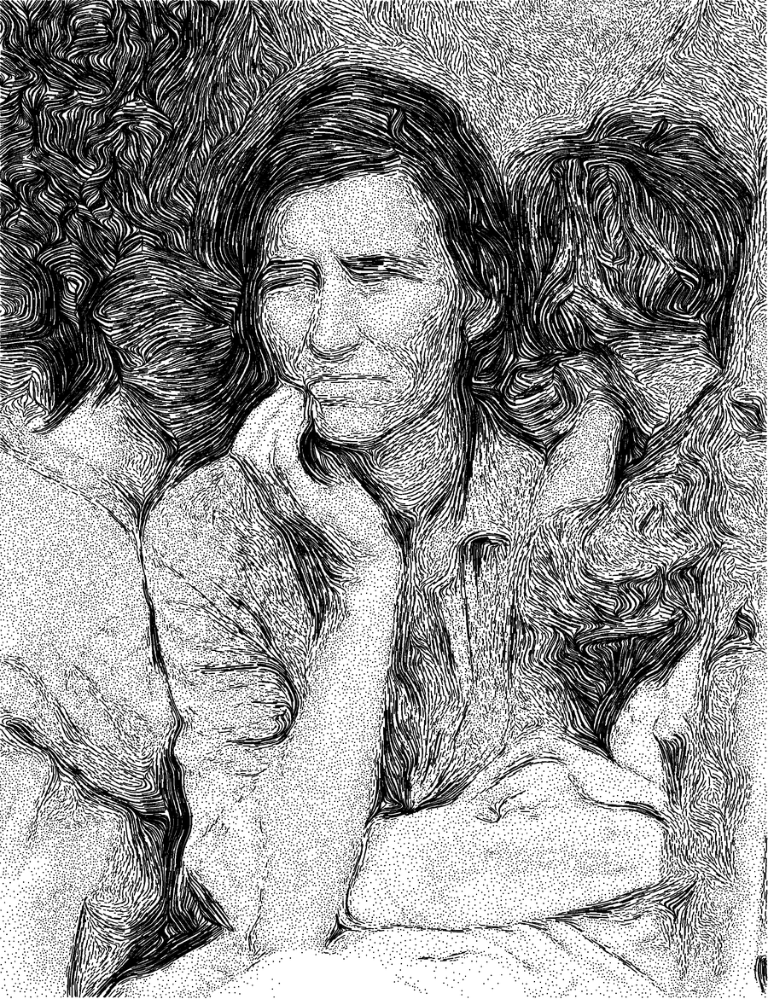

# engrave

Turns a photo into pen-plottable stipple + hatch line art. Tone becomes a darkness map;
a structure tensor gives a flow field whose minor eigenvector follows the isophotes, so
hatching curves around forms; seeds are placed by variable-radius Poisson disk against an
ink-coverage budget; and RK2 streamlines are traced through the flow, with stroke length
falling to zero in light areas — which is what turns hatching into stippling.

It is one continuous mechanism, not two modes. Nothing in the pipeline decides "this region
is a stipple region": short strokes simply degenerate into dots.

Two controls sit on top of that. `--white-point` forces the lightest tones to zero, and zero
tone means no seed at all, so highlights fall away to bare paper instead of thinning into an
endless sparse stipple. `--cross-above` runs the whole seed-and-trace pass a second time over
the dark end of the range, with the flow field rotated by `--cross-angle`, which gives the
shadows real cross-hatching that still curves with the form.

[](example/migrant-mother.svg)

55,049 strokes — 24,810 of them degenerate dots. The plottable original is
[`example/migrant-mother.svg`](example/migrant-mother.svg).

Example image: [Migrant Mother, Nipomo, California, 1936](https://commons.wikimedia.org/wiki/File:Lange-MigrantMother02.jpg), public domain, Wikimedia Commons.

## Web app

<https://fbourke.github.io/engrave-drawing/> — or open `index.html` locally. It runs entirely
in the browser: no server, no build step, no dependencies, and it works from `file://`.

- drag & drop an image onto the page, or use `load image`
- sliders grouped under `tone`, `flow`, `marks`, `output`; `?` next to each explains it
- `white point` clears the highlights to bare paper; `cross above` / `cross angle` lay a
  cross-hatch layer over the shadows
- drag on the image to set the flat hatch angle — it only shows where the image has no
  direction of its own
- a draggable split divider compares the result against either the tone map or a
  line-integral-convolution view of the flow field
- a mask panel (ellipse / rect / lasso, invert, remove) trims lines geometrically
- a CLI command readout showing the exact `./engrave.py …` invocation for the current
  settings, with `copy`
- a paper dropdown (A0–A5, ANSI C–E, Tabloid, Legal, Letter, Half Letter, or pixels) and
  two downloads: `download svg` and `python script`

The web app is a port, and it uses a different PRNG than numpy. Its stipple pattern is
statistically the same as the CLI's, but not point-identical. It also computes on a
downscaled image to stay interactive. Use the Python script for final plotter output.

## CLI

`engrave.py` is a uv script with an inline dependency block, so it self-installs:

```
./engrave.py photo.jpg -o out.svg --width 200
```

Without uv:

```
pip install numpy pillow scipy
python engrave.py photo.jpg -o out.svg --width 200
```

The example above was produced with:

```
./engrave.py example/migrant-mother-1936.jpg -o example/migrant-mother.svg \
  --width 200 --max-px 900 --gamma 1.35 --contrast 1.3 --dot-below 0.3
```

### Parameters

| flag | default | effect |
|---|---|---|
| `image` | — | input image, any format PIL reads |
| `-o`, `--output` | `<image>-engraved.svg` | output path |
| `--width` | `200` | page width in mm; sets the px→mm scale |
| `--max-px` | `900` | working resolution, longest side in px |
| `--spacing` | `3.2` | base seed spacing in px; bigger = sparser |
| `--detail` | `1.0` | scales `--spacing`; <1 = finer, denser art |
| `--max-coverage` | `0.82` | ink coverage at pure black; 1.0 = solid fill |
| `--min-spacing` | `0.8` | hard floor on seed spacing, px |
| `--contrast` | `1.15` | contrast about the tone midpoint |
| `--gamma` | `1.0` | >1 lightens midtones, <1 darkens |
| `--white-point` | `0.0` | tone below this gets no marks at all, giving true paper white |
| `--invert` | off | invert the image before tone mapping |
| `--flow-blur` | `4.0` | structure-tensor smoothing; larger = calmer flow |
| `--flat-angle` | `25.0` | hatch angle in featureless regions, degrees |
| `--coh-floor` | `0.35` | anisotropy below which the flat angle takes over |
| `--max-steps` | `14` | max stroke half-length, in steps |
| `--step` | `1.1` | trace step, px |
| `--min-tone` | `0.06` | strokes stop when they wander into lighter area |
| `--dot-below` | `0.22` | tone below this becomes stipple instead of hatch |
| `--len-gamma` | `1.3` | exponent mapping darkness to stroke length |
| `--cross-above` | `1.0` | tone above this also gets a cross-hatch pass; `1.0` = off |
| `--cross-angle` | `55.0` | cross-hatch angle relative to the flow, degrees |
| `--dot-size` | `0.35` | dot mark size, px |
| `--stroke` | `0.3` | drawn stroke width in mm; affects nothing but the rendered line |
| `--pack-width` | `0.0` | stroke width the spacing assumes, mm; `0` follows `--stroke` |
| `--seed` | `0` | PRNG seed for the Poisson darts |

## Credits

The web app is modelled on **[contour-drawing](https://github.com/TLausZ/contour-drawing)**
by [TLausZ](https://github.com/TLausZ) (MIT), which draws geodesic contour lines by solving
the Eikonal equation with a fast marching method — a different algorithm to this one, and
well worth a look: <https://tlausz.github.io/contour-drawing/>

This is not a fork; it shares no commit history. The engraving algorithm, the Python CLI and
the JavaScript that implements them are independent work. But the interface is very much
theirs: the mask panel and its line clipper, the paper/ink palette and layout, the slider and
help-popover pattern, the split-divider comparison, the paper-size table, and the
worker-from-a-Blob trick that lets the page run from `file://` are all reused from
contour-drawing, with the German comments translated. Their MIT notice is carried in
[`LICENSE`](LICENSE).

## Licence

MIT — see [`LICENSE`](LICENSE), which also carries the third-party notice above.

## Publishing

The site is plain static files. Settings → Pages → Deploy from a branch → `main` → `/ (root)`.
`.nojekyll` keeps GitHub Pages from processing the files.
